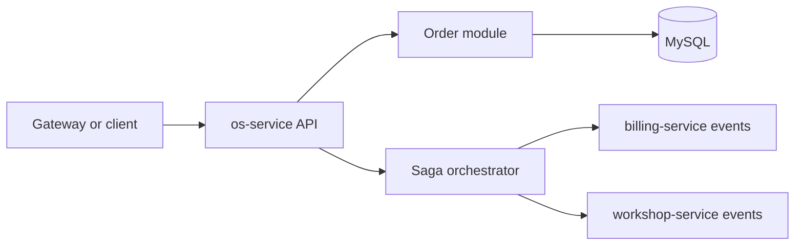

# OS Service

`os-service` owns service orders and the orchestrated Saga for the Phase 4
flow.

## Responsibility

- service-order lifecycle
- public and protected order queries
- Saga orchestration
- happy path from budget to execution finish
- compensation flow for payment and stock rollback
- correlation through `correlationId` and `sagaId`

This service owns its own MySQL database and does not access the databases of
other services.

## Technology

- NestJS
- TypeORM
- MySQL
- RabbitMQ messaging
- Swagger
- BDD flow with `jest`
- Prometheus `/metrics`
- JSON logs with `correlationId` and `sagaId`
- Dockerfile and Docker Compose
- Kubernetes manifests
- Sonar configuration

## Architecture



## Data Ownership

- owned database: MySQL
- owned aggregates: orders, order history, saga instances, consumed message ledger
- no cross-service database access

## Main API Groups

Swagger is the reference for the full contract:

- local Swagger URL: `http://localhost:3000/docs`
- route groups:
  - `Orders`
  - `Public Orders`
  - `platform`

## Saga

Implemented:

- happy path
  - `budget.requested`
  - `budget.created`
  - `budget.approved`
  - `payment.created`
  - `payment.approved`
  - `stock.reserve.requested`
  - `stock.reserved`
  - `execution.requested`
  - `execution.started`
  - `execution.finished`
- compensation
  - `budget.rejected`
  - `payment.failed`
  - `stock.reservation.failed`
  - `execution.failed`
  - `stock.release.requested`
  - `stock.released`
  - `stock.release.failed`
  - `payment.refund.requested`
  - `payment.refunded`
  - `payment.refund.failed`

The service preserves `correlationId` and `sagaId` through commands, results,
logs and persisted Saga context.

## Published Events

- `budget.requested`
- `stock.reserve.requested`
- `execution.requested`
- `stock.release.requested`
- `payment.refund.requested`

## Consumed Events

- `budget.created`
- `budget.approved`
- `budget.rejected`
- `payment.created`
- `payment.approved`
- `payment.failed`
- `payment.refunded`
- `payment.refund.failed`
- `stock.reserved`
- `stock.reservation.failed`
- `stock.released`
- `stock.release.failed`
- `execution.started`
- `execution.finished`
- `execution.failed`

## Environment Variables

See `.env.example` for the safe local template.

Key variables:

- `DB_HOST`
- `DB_PORT`
- `DB_USERNAME`
- `DB_PASSWORD`
- `DB_DATABASE`
- `DB_SSL`
- `CUSTOMER_SERVICE_BASE_URL`
- `WORKSHOP_SERVICE_BASE_URL`
- `JWT_SECRET`
- `JWT_ISSUER`
- `JWT_AUDIENCE`
- `MESSAGING_ENABLED`
- `CONSUMED_MESSAGE_LEASE_MS`
- `METRICS_ENABLED`

Do not commit real secrets.

## Local Execution

```bash
npm ci
npm run start:dev
```

Local supporting assets:

- `Dockerfile`
- `docker-compose.yml`

## Migrations

```bash
npm run migration:run
npm run migration:run:prod
npm run migration:revert
```

## Tests And Validation

```bash
npm run format
npm run lint
npm run build
npm run test:bdd
npm test -- --runInBand
npm run test:cov
docker compose --env-file .env.example config
kubectl kustomize k8s
```

Jest enforces `80%` minimum for statements, branches, functions and lines.

## BDD

Executable BDD evidence:

- feature: `test/bdd/features/complete-service-order-flow.feature`
- command: `npm run test:bdd`

The BDD flow uses in-memory doubles at the existing boundaries. It does not use
real RabbitMQ, MySQL, MongoDB or Mercado Pago.

## CI/CD

Workflow files:

- `.github/workflows/ci.yml`
- `.github/workflows/cd.yml`

CI validates lint, build, BDD, coverage, Docker build, Kubernetes render and
Sonar.

CD is configured for:

- `homologation` -> GitHub Environment `homologation`
- `main` -> GitHub Environment `production`

This README documents pipeline configuration only. It does not claim a hosted
deployment was executed from this workspace.

## Kubernetes

This repository contains service-local manifests under `k8s/`:

- `Deployment`
- `Service`
- `ConfigMap`
- `Secret` template
- `HorizontalPodAutoscaler`

Local render:

```bash
kubectl kustomize k8s
```

## Observability

- `/metrics`
- JSON logs
- `correlationId`
- `sagaId`
- readiness `/ready`
- liveness `/health`
- order volume and processing failure metrics

## External Dependencies

- `customer-service` HTTP API
- `workshop-service` HTTP API and RabbitMQ events
- `billing-service` RabbitMQ events
- MySQL
- RabbitMQ

## Delivery Evidence

- repository URL: `PENDING`
- homologation URL: `PENDING`
- latest successful CI run: `PENDING`
- quality gate: `PENDING`
- coverage evidence: `95.96% statements, 81.26% branches, 88.88% functions, 96.5% lines (local artifact); hosted link/print PENDING`
- branch protection: `PENDING VERIFICATION`
- Swagger hosted URL: `PENDING`

## External Evidence Status

- hosted repository and Swagger URLs: `PENDING`
- branch protection and environments: `PENDING VERIFICATION`
- no deploy was executed from this workspace
